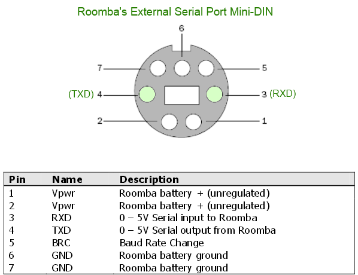

# jetroomba
A repo for getting the Nvidia Jetson / Jetbot running on a Roomba!  We've slightly modified the framework provided by Nvidia's [JetBot repo](https://github.com/NVIDIA-AI-IOT/jetbot).  You should start there, and then consider modifiying the motor control using the source code within this repo.

# Getting Started

## Hardware
The easiest option is to use a USB->TTL converter.  (e.g. [Amazon](https://www.amazon.com/gp/product/B06XDPMY4Z/ref=ppx_yo_dt_b_search_asin_title?ie=UTF8&psc=1)) It should be possible to use the JetBot's UART lines, but I haven't tried it.  

For convenience, the Roomba's serial pinout is shown here:



We're making use of a custom mount that holds the JetBot and camera.

Todo:  Add STL files.

## Software
Clone this repo!  You'll then need to add the Python files to the installed location of the JetBot Python3 module. (e.g. ```/usr/local/lib/python3.6/dist-packages/jetbot-0.3.0-py3.6.egg/jetbot/```)  

To use these motor/robot modules within the JetBot Jupyter Notebooks, you'll need to replace the robot object, e.g.:
```
from jetbot import roombarobot
robot = roombarobot.Robot()
```

It's recommended you try this out using the tele-operation Jupyter Notebook to make sure things are working.

# Known Issues
- The Roomba will go into a safe mode if it is picked up or a wheel goes off the edge of table.  The current code will not change the mode until it's re-initialized.
- If serial communication is idle for awhile, the Roomba turns off.  You'll need to press the power button on the Roomba to wake it back up.
